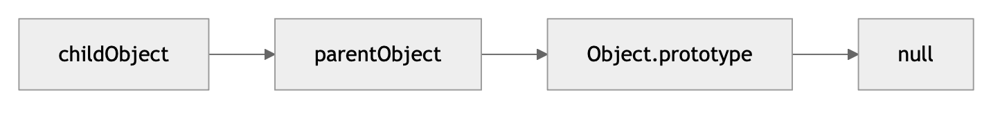

## Prototype

[[orange]Prototype] - это объект, через который JavaScript реализует наследование. Если свойство не найдено на самом объекте, JS ищет его в prototype chain.



- childObject: объект, в котором производим поиск свойства.
- parentObject: прототип объекта childObject.
- Object.prototype: базовый прототип, из которого наследуются все объекты, если не указано иное.
- null: конец цепочки; если свойство не найдено до этого момента, результат будет undefined.

```ts
const user = {
  name: 'Ada',
};

console.log(user.toString); // найдено выше по prototype chain
```

Пример:

```ts
function User(name: string) {
  this.name = name;
}

User.prototype.sayName = function () {
  return this.name;
};

const user = new User('Ada');

console.log(user.sayName()); // Ada
```

Что делает `new`:

1. Создает новый объект.
2. Связывает его prototype с `User.prototype`.
3. Вызывает функцию `User` с `this`, указывающим на новый объект.
4. Возвращает объект, если constructor явно не вернул другой объект.

## Свойство `[[Prototype]]` и `proto`

В спецификации ECMAScript у каждого объекта есть внутреннее свойство `[[Prototype]]`, которое указывает на прототип. Исторически для доступа к нему многие среды (например, браузеры) предоставляют геттер/сеттер `__proto__`, однако это считается устаревшим.

Современный способ — `Object.getPrototypeOf` и `Object.setPrototypeOf`.

```ts
const parent = {
  greet: function () {
    console.log('Hello!');
  },
};
const child = {};

// Устанавливаем parent как прототип child
Object.setPrototypeOf(child, parent);

// Теперь у child есть доступ к greet() через цепочку прототипов
child.greet(); // "Hello!"

console.log(Object.getPrototypeOf(child) === parent); // true
```

## `Object.create`

Самый удобный способ создать объект с нужным прототипом — использовать метод `Object.create`:

```ts
const person = {
  sayName() {
    console.log(`My name is ${this.name}`);
  },
};

const john = Object.create(person);
john.name = 'John';
john.sayName(); // My name is John
```

- person выступает «родителем» (прототипом).
- john — новый объект, чей `[[Prototype]]` указывает на person.

## Цепочка прототипов (Prototype Chain)

Если мы вызываем свойство/метод `john.sayName()`, и в `john` такого свойства нет, JS будет искать это свойство в `person`. Если бы в `person` не было `sayName`, интерпретатор пошёл бы в `person.__proto__`, которым чаще всего является `Object.prototype`, и так далее.

## Итог

- Прототип — это механизм, позволяющий одним объектам наследовать свойства и методы других объектов.
- В JS каждый объект имеет скрытое свойство `[[Prototype]]`, которое обычно ссылается на другой объект или **null**.
- Цепочка прототипов позволяет искать свойство «снизу вверх»: от объекта к его прототипу, затем к прототипу прототипа, и так далее.
- Функции-конструкторы (до ES6) и классы (с ES6) используют прототипы «под капотом». Классы — просто «синтаксический сахар» над функциями-конструкторами.
- `Object.create` — удобный способ создавать объекты, указывая прототип напрямую. Прототипное наследование даёт мощный, гибкий подход к реализации ООП без жёсткой привязки к классам.

## Источники и лицензия

- [Scope в JavaScript: глобальная, функциональная, блочная](https://www.hackfrontend.com/ru/docs/javascript/scope-in-js)
- [Лексическое окружение (Lexical Environment) в JavaScript](https://www.hackfrontend.com/ru/docs/javascript/lexical-environment)
